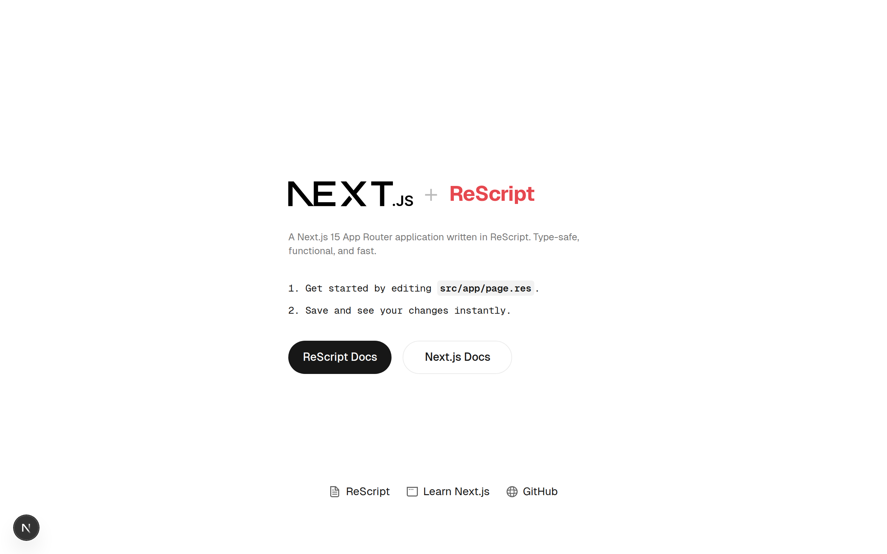

# ReScript + Next.js App Router

A [Next.js](https://nextjs.org) 15 App Router application written in [ReScript](https://rescript-lang.org), using [Bun](https://bun.sh) as the package manager and [Tailwind CSS](https://tailwindcss.com) for styling.



## Getting Started

Install dependencies:

```bash
bun install
```

Compile ReScript and start the development server:

```bash
bun run res:build
bun dev
```

Open [http://localhost:3000](http://localhost:3000) with your browser to see the result.

You can start editing the page by modifying `src/app/page.res`. The page auto-updates as you edit the file.

For ReScript watch mode (auto-recompile on save), run in a separate terminal:

```bash
bun run res:dev
```

## Project Structure

```
src/
├── app/
│   ├── layout.res       # Root layout (fonts, metadata, CSS)
│   ├── page.res         # Home page
│   └── globals.css      # Tailwind CSS + theme variables
└── bindings/
    ├── NextAppRouter.res # Client-side Next.js bindings
    └── NextAppServer.res # Server-side Next.js bindings
```

## Scripts

| Command | Description |
|---|---|
| `bun dev` | Start development server |
| `bun run build` | Compile ReScript + build for production |
| `bun run res:build` | Compile ReScript files |
| `bun run res:dev` | ReScript watch mode |
| `bun run res:clean` | Clean ReScript build artifacts |
| `bun run lint` | Run Biome linter and formatter checks |
| `bun run format` | Auto-format code with Biome |

## Learn More

- [ReScript Documentation](https://rescript-lang.org/docs/manual/latest/introduction) - learn about ReScript syntax and features.
- [Next.js Documentation](https://nextjs.org/docs) - learn about Next.js features and API.
- [ReScript React](https://rescript-lang.org/docs/react/latest/introduction) - ReScript bindings for React.

## Deploy on Vercel

The easiest way to deploy your Next.js app is to use the [Vercel Platform](https://vercel.com/new?utm_medium=default-template&filter=next.js&utm_source=create-next-app&utm_campaign=create-next-app-readme) from the creators of Next.js.

Check out the [Next.js deployment documentation](https://nextjs.org/docs/app/building-your-application/deploying) for more details.
